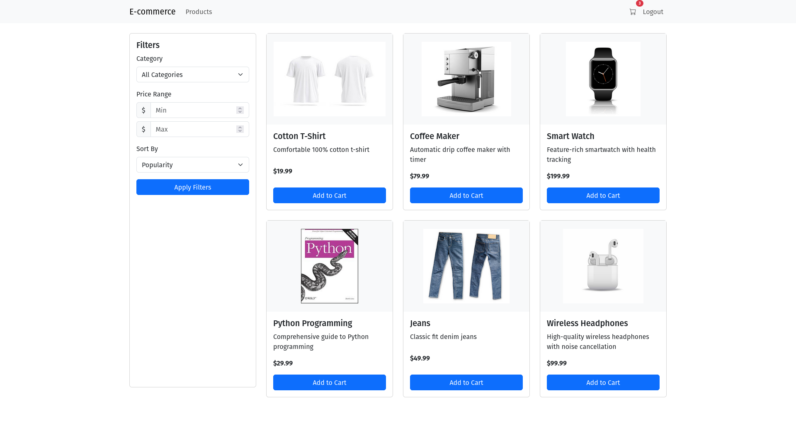
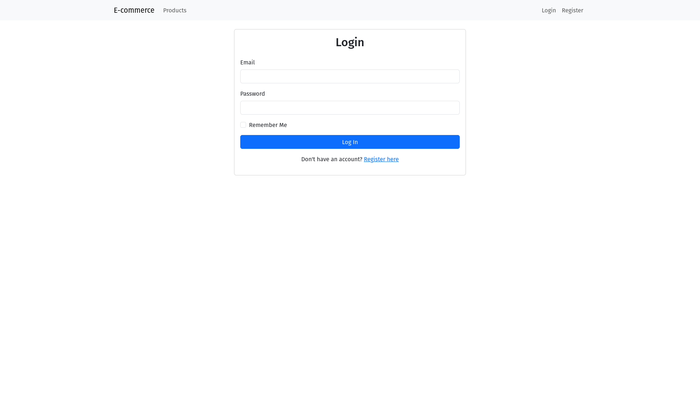
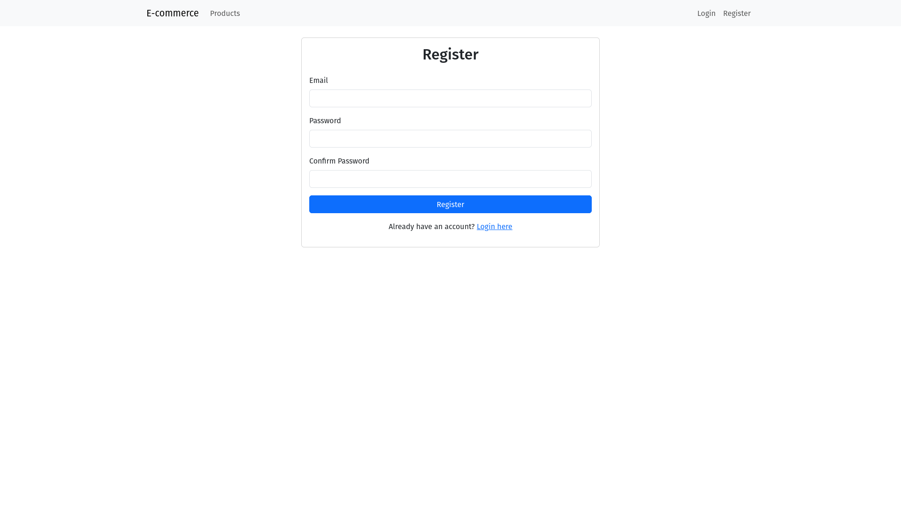
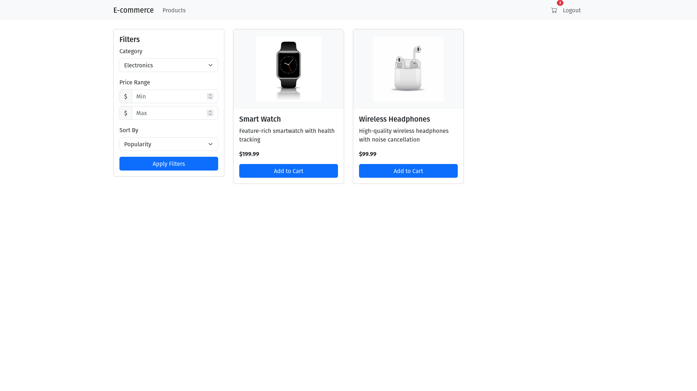
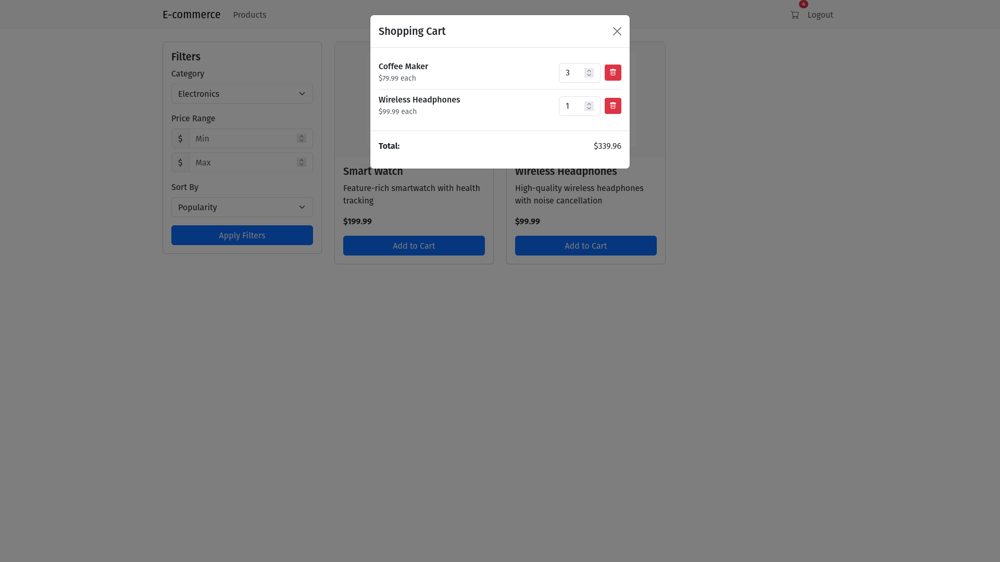

# E-commerce Web Application

A Flask-based e-commerce platform that provides essential shopping functionalities: product browsing, user authentication, and cart management.



## Features

- **User Registration & Authentication**
  - Email-based user registration and login
  - Secure password handling with bcrypt
  - Session management with Flask-Login
  
  
  

- **Product Catalog**
  - Browse products by categories
  - View product details including images, descriptions, and prices
  - Filter products by various criteria
  
  
  

- **Shopping Cart**
  - Add products to cart
  - Adjust quantities or remove items
  - Persistent cart tied to user account
  
  
  

## Tech Stack

- **Backend**
  - Python 3.8+
  - Flask 2.3.3
  - SQLAlchemy ORM
  - SQLite Database

- **Frontend**
  - HTML5/CSS3
  - Bootstrap 5
  - JavaScript (Vanilla)

- **Authentication**
  - Flask-Login
  - Werkzeug security utilities

## Setup and Installation

### Prerequisites
- Python 3.8+
- pip package manager

### Installation Steps

1. Clone the repository
   ```
   git clone https://github.com/yourusername/ecommerce.git
   cd ecommerce
   ```

2. Create and activate a virtual environment (optional but recommended)
   ```
   python -m venv venv
   source venv/bin/activate  # On Windows: venv\Scripts\activate
   ```

3. Install dependencies
   ```
   pip install -r requirements.txt
   ```

4. Set up environment variables
   Create a `.env` file in the root directory with:
   ```
   SECRET_KEY=your-secret-key
   ```

5. Populate the database with sample products
   ```
   python populate_db.py
   ```

6. Run the application
   ```
   python run.py
   ```

7. Access the application in your browser
   ```
   http://127.0.0.1:5000/
   ```

## Project Structure

```
ecommerce/
├── app/
│   ├── auth/             # Authentication related routes and forms
│   ├── cart/             # Shopping cart functionality
│   ├── main/             # Main routes (home, products)
│   ├── static/           # CSS, JS, and images
│   ├── templates/        # HTML templates
│   ├── __init__.py       # Flask application factory
│   └── models.py         # Database models
├── instance/             # Database instance
├── screenshots/          # Application screenshots
├── requirements.txt      # Python dependencies
├── run.py                # Application entry point
├── populate_db.py        # Database seeding script
└── README.md             # This file
```

## Database Models

- **User**: Stores user authentication details
- **Product**: Contains product information
- **CartItem**: Tracks items in user shopping carts

## Usage

1. Register for an account or log in if you already have one
2. Browse products by category
3. Click on products to view details
4. Add items to your shopping cart
5. Adjust quantities or remove items in the cart

## Development

### Environment
- Flask debug mode is enabled during development
- SQLite database for easy setup

### Adding Products
Products can be added through the `populate_db.py` script.

## Future Enhancements

- Checkout process
- Payment gateway integration 
- User profile management
- Admin dashboard
- Order history
- Product reviews and ratings

## License

This project is licensed under the MIT License - see the LICENSE file for details. 